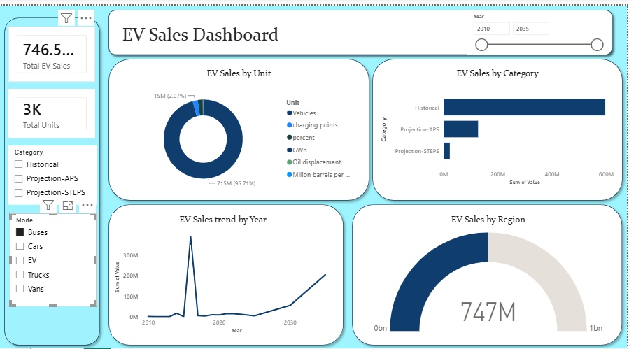

# Globe-Electric-Vehicle-Sales-Analysis

## 📌 Project Overview

This project focuses on analyzing Electric Vehicle (EV) sales data and creating an interactive dashboard to understand sales performance across different years, categories, regions, and modes.

The project follows an end-to-end data analysis workflow using MySQL, Python libraries, Excel, and Power BI.

## 🛠️ Tools & Technologies

- MySQL
- Pandas
- Matplotlib
- Seaborn
- Microsoft Excel
- Power BI

## 🔄 Project Workflow

Raw EV Dataset
↓
MySQL Database
↓
Pandas
↓
Matplotlib & Seaborn
↓
Excel
↓
Power BI Dashboard

## 🗄️ MySQL

- Created a MySQL database for the EV sales dataset.
- Created/imported the table using the MySQL Table Data Import Wizard.
- Used MySQL primarily for database creation and data storage.

## 🐍 Python Libraries

### Pandas
- Loaded and worked with the dataset.
- Performed data preparation and analysis.

### Matplotlib
- Created visualizations to understand EV sales patterns.

### Seaborn
- Created additional statistical/data visualizations.

## 📊 Power BI Dashboard

The processed Excel dataset was loaded into Power BI to create an interactive dashboard.

### Dashboard Features

- Total EV Sales KPI
- Total Units KPI
- EV Sales by Category
- EV Sales by Region
- EV Sales Trend by Year
- Interactive Year slicer
- Category filter
- Mode filter

## 📈 Key Analysis Areas

- Year-wise EV sales trends
- EV sales by category
- Regional EV sales performance
- Unit-wise sales analysis
- Comparison of different EV modes

## 🎯 Project Objective

The main objective of this project is to transform raw EV sales data into meaningful insights using data analysis and visualization techniques, and present the results through an interactive Power BI dashboard.

## 📂 Dashboard preview
- 

## 👨‍💻 Skills Demonstrated

`MySQL` `Pandas` `Matplotlib` `Seaborn` `Excel` `Power BI` `Data Analysis` `Data Visualization`

